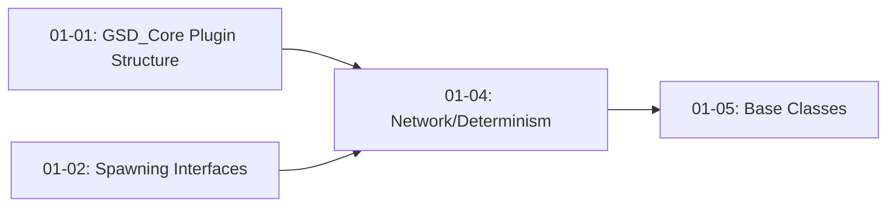

# Phase 1 Plan 4: Network and Determinism Interfaces Summary

---
phase: 01-plugin-architecture-foundation
plan: 04
subsystem: core-interfaces
tags: [unreal, networking, determinism, interfaces, blueprint]
completed: 2026-02-25
duration: 3 min
---

## One-Liner

Server-authoritative network spawn validation and determinism verification interfaces for future multiplayer support and reproducible runs.

## Requirements Addressed

- **PLUG-08**: Network spawn validation interface
- **PLUG-09**: Determinism verification interface

## Files Created

| File | Purpose |
|------|---------|
| `Plugins/GSD_Core/Source/GSD_Core/Public/Interfaces/IGSDNetworkSpawnValidator.h` | Network spawn validation interface header |
| `Plugins/GSD_Core/Source/GSD_Core/Private/Interfaces/IGSDNetworkSpawnValidator.cpp` | Network spawn validation implementation |
| `Plugins/GSD_Core/Source/GSD_Core/Public/Interfaces/IGSDSpawnStateValidator.h` | Determinism verification interface header |
| `Plugins/GSD_Core/Source/GSD_Core/Private/Interfaces/IGSDSpawnStateValidator.cpp` | Determinism verification implementation |

## Implementation Details

### IGSDNetworkSpawnValidator

Server-authoritative spawn validation interface for future multiplayer support:

- **ValidateSpawnRequest**: Called on server to validate spawn requests before execution
- **NotifySpawnComplete**: Callback when spawn completes (for client notification)
- **NotifySpawnRejected**: Callback when spawn is rejected with reason
- **IsServerAuthoritative**: Check if spawns require server approval (default: true)
- **GetRequestingPlayer**: Get the player controller requesting the spawn
- **SetNetworkParams**: Configure network spawn parameters (replication, roles, etc.)

### IGSDSpawnStateValidator

Determinism verification interface for reproducible runs:

- **ValidateSpawnState**: Compare current state against expected state
- **ComputeSpawnHash**: Hash current spawn state for comparison
- **LogDivergence**: Log divergence details using GSD_WARN macro
- **GetCurrentSpawnState**: Capture current spawn state as tickets
- **RecordSpawn**: Record spawn for replay/debugging
- **ClearSpawnHistory**: Clear recorded spawns
- **GetSpawnCount**: Get total spawns this session

## Decisions Made

| Decision | Rationale |
|----------|-----------|
| Default ValidateSpawnRequest returns true | Single-player games ignore network validation |
| Default IsServerAuthoritative returns true | Secure by default for multiplayer |
| LogDivergence uses GSD_WARN | Consistent logging with rest of GSD_Core |
| Interfaces are Blueprintable | Allow Blueprint-only actors to implement |

## Deviations from Plan

None - plan executed exactly as written.

## Verification Checklist

- [x] IGSDNetworkSpawnValidator compiles with all methods
- [x] IGSDSpawnStateValidator compiles with all methods
- [x] FGSDSpawnTicket reference parameters work
- [x] FGSDSeededSpawnTicket array parameters work
- [x] FString& out parameter compiles correctly
- [x] GSD_WARN used for divergence logging
- [x] All generated.h includes are last

## Commits

| Hash | Message |
|------|---------|
| 246525b | feat(01-04): implement IGSDSpawnStateValidator interface |
| 0e1d9db | feat(01-04): implement IGSDNetworkSpawnValidator interface |

## Next Phase Readiness

Ready for Plan 05 (Base Classes). These interfaces will be implemented by:
- AGSDSpawnManager (implements IGSDNetworkSpawnValidator)
- UGSDDeterminismManager (implements IGSDSpawnStateValidator)

## Dependency Graph

**Requires:** Plans 01, 02 (types and logging infrastructure)
**Provides:** Network and determinism validation contracts
**Affects:** Plan 05 (Base Classes), Plan 06 (Managers)
