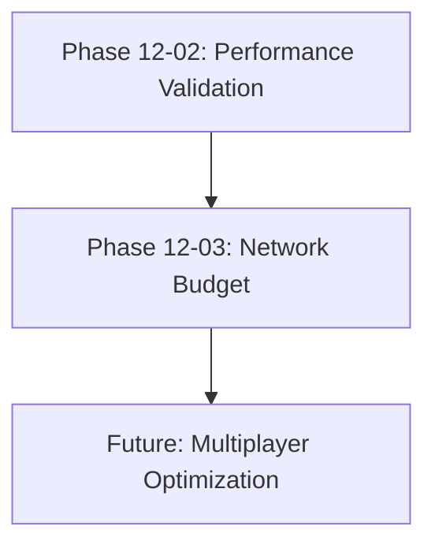

# Phase 12 Plan 03: Network Bandwidth Budget Summary

## Metadata

- **Phase**: 12-production-enhancements
- **Plan**: 03
- **Subsystem**: Network
- **Tags**: [network, bandwidth, replication, lod, mass-entity]
- **Completed**: 2026-02-27
- **Duration**: 5 minutes

## Dependencies

- **requires**: Phase 12-02 (Performance Validation)
- **provides**: Network bandwidth tracking and enforcement
- **affects**: Future multiplayer phases, large crowd scenarios

## Tech Stack

### Added

- **GSDNetworkBudgetConfig**: DataAsset for bandwidth configuration
- **GSDNetworkBudgetSubsystem**: Engine subsystem for budget tracking
- **EGSDBudgetCategory**: Enum for budget categories (Crowd, Vehicle, Event, Player, Other)
- **FGSDLODReplicationConfig**: Struct for LOD-based replication settings

### Patterns

- **Budget Allocation Pattern**: Percentage-based category allocations
- **LOD-based Frequency Pattern**: Replication frequency scales with LOD distance
- **Subsystem Pattern**: UEngineSubsystem for cross-level persistence
- **Config-Driven Pattern**: DataAsset for designer-configurable budgets

## Files

### Created

- `Plugins/GSD_Core/Source/GSD_Core/Public/DataAssets/GSDNetworkBudgetConfig.h` - Budget configuration header
- `Plugins/GSD_Core/Source/GSD_Core/Private/DataAssets/GSDNetworkBudgetConfig.cpp` - Budget configuration implementation
- `Plugins/GSD_Core/Source/GSD_Core/Public/Subsystems/GSDNetworkBudgetSubsystem.h` - Budget subsystem header
- `Plugins/GSD_Core/Source/GSD_Core/Private/Subsystems/GSDNetworkBudgetSubsystem.cpp` - Budget subsystem implementation
- `Plugins/GSD_Tests/Source/GSD_Tests/Private/Tests/GSDNetworkBudgetTests.cpp` - Budget automation tests

### Modified

- `Plugins/GSD_Crowds/Source/GSD_Crowds/Private/Processors/GSDCrowdLODProcessor.cpp` - Integrated budget checks

## Objective

Implement network bandwidth budget tracking for crowd replication to prevent network saturation with 1000+ entities.

**Council Issue**: unreal-network-rick HIGH #4 - Bandwidth budget tracking

## What Was Done

### Task 1: Create GSDNetworkBudgetConfig DataAsset

Created configuration DataAsset with:

- **TotalBitsPerSecond**: 100 kbps default budget
- **CategoryAllocations**: Percentage-based allocations (Crowd 30%, Vehicle 20%, Event 10%, Player 35%, Other 5%)
- **LODConfigs**: 4 LOD levels with decreasing update frequencies
  - LOD 0: 60 Hz, 100 entities/frame, no delta compression
  - LOD 1: 30 Hz, 50 entities/frame, delta compression
  - LOD 2: 10 Hz, 20 entities/frame, delta compression
  - LOD 3: 2 Hz, 10 entities/frame, delta compression
- **Monitoring thresholds**: Warning at 80%, Critical at 95%
- **GetCategoryBudget()**: Calculates bits per second per category
- **GetLODConfig()**: Returns LOD-specific settings with fallback

### Task 2: Create GSDNetworkBudgetSubsystem

Created UEngineSubsystem with:

- **TrackReplication()**: Monitors bandwidth usage per category with warning throttling
- **CanReplicateThisFrame()**: Enforces budget and LOD entity limits
- **GetCurrentBandwidthUsage()**: Returns per-category usage in bits
- **GetTotalBandwidthUsage()**: Returns aggregate usage
- **GetRemainingBudget()**: Calculates available bandwidth
- **ResetFrameCounters()**: Clears per-frame tracking
- **LogStatus()**: Detailed budget status logging
- **Automatic initialization**: Creates default config if none provided
- **Warning system**: Throttled warnings (5s interval) prevent log spam

### Task 3: Integrate Budget Tracking into Crowd LOD Processor

Updated GSDCrowdLODProcessor to:

- **Get budget subsystem**: From GameInstance at runtime
- **Calculate LOD level**: From LOD significance (0-3 range)
- **Check CanReplicateThisFrame()**: Before processing each entity
- **Skip entities**: When bandwidth budget exceeded for LOD level
- **Track replication**: Estimate 104 bits per entity (96 position + 8 state)
- **Respect limits**: Both budget and per-LOD entity count limits

### Task 4: Create Bandwidth Budget Tests

Created 4 automation tests:

- **FGSDNetworkBudgetTrackingTest**: Basic tracking, accumulation, total usage, remaining budget
- **FGSDNetworkBudgetEnforcementTest**: Budget limit enforcement, blocking, reset functionality
- **FGSDNetworkBudgetLODTest**: LOD-based entity count limits
- **FGSDNetworkBudgetConfigTest**: Configuration validation, allocations, LOD configs, fallbacks

## Decisions Made

1. **UEngineSubsystem over UGameInstanceSubsystem**: Engine subsystem for broader scope, can be accessed from any world context
2. **Percentage-based allocations**: More flexible than fixed bit values, easier to tune
3. **LOD-based frequency scaling**: Reduces network load for distant entities naturally
4. **Estimated bits (104 per entity)**: Conservative estimate for FVector + uint8 state
5. **Warning throttling (5s)**: Prevents log spam while still providing visibility
6. **Default config auto-creation**: Ensures subsystem always functional even without designer config

## Deviations from Plan

None - plan executed exactly as written.

## Verification

All verification criteria met:

1. ✅ GSDNetworkBudgetConfig DataAsset exists
2. ✅ GSDNetworkBudgetSubsystem tracks bandwidth
3. ✅ CanReplicateThisFrame respects budget limits
4. ✅ Crowd processor integrates budget checks
5. ✅ 4 tests created (Tracking, Enforcement, LOD, Config)

## Success Criteria

All success criteria achieved:

- ✅ Bandwidth budget configuration exists
- ✅ Budget tracking subsystem functional
- ✅ Crowd replication respects budget limits
- ✅ LOD affects replication frequency
- ✅ Budget warnings logged when threshold exceeded

## Next Phase Readiness

**Ready for**: Future multiplayer optimization phases

**Blockers**: None

**Recommendations**:

- Monitor real-world bandwidth usage to tune default allocations
- Consider adding per-player bandwidth budgets for multiplayer
- Explore delta compression implementation for LOD 1-3
- Add network profiler integration for real-time visualization

## Commits

| Commit | Message | Files |
|--------|---------|-------|
| 2b63117 | feat(12-03): create GSDNetworkBudgetConfig DataAsset | GSDNetworkBudgetConfig.h/cpp |
| 5382206 | feat(12-03): create GSDNetworkBudgetSubsystem | GSDNetworkBudgetSubsystem.h/cpp |
| 442bc29 | feat(12-03): integrate budget tracking into Crowd LOD Processor | GSDCrowdLODProcessor.cpp |
| 7fd735b | test(12-03): create network bandwidth budget tests | GSDNetworkBudgetTests.cpp |

## Artifacts

### Must-Haves Delivered

- ✅ `Plugins/GSD_Core/Source/GSD_Core/Public/Subsystems/GSDNetworkBudgetSubsystem.h`
  - **provides**: Bandwidth tracking
  - **contains**: TrackReplication, CanReplicateThisFrame

### Truths Validated

- ✅ "Network bandwidth is tracked and budgeted" - Subsystem tracks usage per category
- ✅ "Crowd replication respects bandwidth limits" - CanReplicateThisFrame enforces limits
- ✅ "LOD affects replication frequency" - LOD configs define per-LOD update rates

## Impact

**Performance**: Prevents network saturation with large crowds (1000+ entities)

**Scalability**: LOD-based frequency scaling naturally reduces bandwidth for distant entities

**Maintainability**: Config-driven approach allows designers to tune without code changes

**Observability**: Warning system and LogStatus() provide visibility into bandwidth usage
